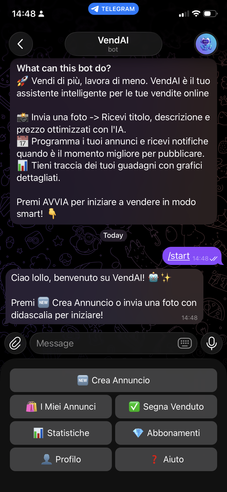

# 🤖 VendAI Bot

🇮🇹 [Leggi questo documento in Italiano](README.it.md))

**VendAI** is a personal Telegram assistant designed for "power sellers" who sell on platforms like Vinted, Depop, eBay, and Facebook Marketplace.

It automates the tedious part of selling: it generates catchy titles and descriptions from a photo using AI, suggests prices, manages a private inventory, and reminds you when to post your ads to maximize visibility.

## ✨ Key Features

* 🧠 **Multimodal AI:** Send a photo, and the bot will generate a title, detailed description, and suggested price optimized for selling.
* 📝 **Interactive Editing Wizard:** Review and refine the AI-generated text before saving it, using an intuitive button-based interface.
* 📅 **Smart Scheduling:** Set a future date (e.g., "tomorrow at 6:30 PM") and receive precise notifications (30 minutes before and at the exact time) to post manually.
* 🗂️ **Multi-User Inventory:** Each user has their own private ad database, isolated from others.
* 📊 **Analytics Dashboard:** View charts and statistics on your earnings, sales performance, and inventory value.
* 🗑️ **Soft Delete:** Never lose your data. Deleted ads can be recovered from the database if needed.

## 📸 Demo

| Main Menu | AI Creation | Analytics Dashboard |
| :---: | :---: | :---: |
|  |  |  |

## 🛠️ Installation

### Prerequisites
* Python 3.9 or higher
* A Telegram bot (created via [@BotFather](https://t.me/BotFather))
* A Google Gemini API key (available for free from [Google AI Studio](https://aistudio.google.com/))

### Step-by-Step Setup

1.  **Clone the repository:**
    ```bash
    git clone [https://github.com/marinollilorenzo/VendAI.git]
    cd VendAI
    ```

2.  **Create and activate a virtual environment (recommended):**
    ```bash
    # On macOS/Linux:
    python3 -m venv venv
    source venv/bin/activate

    # On Windows:
    python -m venv venv
    venv\Scripts\activate
    ```

3.  **Install dependencies:**
    ```bash
    pip install -r requirements.txt
    ```

4.  **Configure environment variables:**
    Create a file named `.env` in the main project folder and enter your secret keys:
    ```env
    TOKEN=your_telegram_bot_token
    GEMINI_API_KEY=your_google_ai_studio_key
    ```

## 🚀 Running the Bot

The bot consists of two processes that must run simultaneously (in two separate terminals, or using a process manager).

1.  **The Interactive Bot (handles user commands):**
    ```bash
    python3 main.py
    ```

2.  **The Notification Guardian (handles schedules):**
    ```bash
    python3 notifier.py
    ```

## 🤝 Contributing

Contributions are welcome! Feel free to open an "Issue" to report bugs or suggest new features, or submit a "Pull Request".

## 📄 License

This project is distributed under the MIT License. See the `LICENSE` file for more details.

---
**Disclaimer:** This is an independent project and is not affiliated, associated, authorized, endorsed by, or in any way officially connected with Vinted, eBay, or any other platform mentioned.
